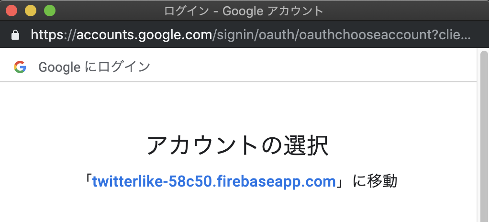

# PWA + FirebaseでサーバーレスなTwitterっぽいアプリを作ってみる

## はじめに

これはサーバーレスなPWAアプリを作るハンズオンのためのプロジェクトで、2回目に実施するハンズオンです。

1回目のハンズオンは以下になります。

https://github.com/uemegu/HandsOnTwitterLike1

<br><br>

## 対象レベル

- HTML/CSS -- 読める（事前準備済み）
- JavaScript -- ES6が読める、調べながら書ける（ほぼ事前準備済み）
- Firebase -- サーバーレスについて意味を知っている

<br><br>

## 目標

今回の目標は2番目の項目です。

1. Twitterのようにメッセージを投稿、表示できる。<br>
「いいね」が送れる。ただし、無認証。<br>
**狙い**：MBaaSを使ってサーバーレスなアプリ構築を体験する。<br>
**キーワード**：FireStore, Functions<br>
**所要時間**：1時間<br><br>
2. 1.で作ったアプリにユーザー登録、認証機能を追加する。<br>
ただし、全ての機能が一つの画面に並んで表示されている。<br>
**狙い**：MBaaSを使ってサーバーレスなアプリ構築を体験する。<br>
**キーワード**：Authentication, FireStore<br>
**所要時間**：0.5時間<br><br>
3. 2.で作ったアプリをSPAにする。<br>
**狙い**：WEBアプリのフロント開発を体験する。<br>
**キーワード**：検討中<br>
**所要時間**：検討中<br><br>

<br><br>

## 事前準備

- 前回のハンズオンが終わっていること

<br><br>

## ハンズオン

前回作ったプロジェクトのフォルダ内で作業を続行します。

<br><br>

### FireStoreの認証の設定

このリポジトリの`firestore.rules`のファイルをそのままコピーしてください。

中身を見ると以下の箇所が前回と変わっています。

なんとなく意味はわかると思いますが、リクエストに認証情報が入ってたらRead/Writeを許可するという意味になります。

````
allow read, write: if request.auth.uid != null;
````

この設定を反映させるために `firebase deploy --only firestore:rules` を実行しましょう。


<br><br>


### クライアント側の準備

実装は既に済ませてあります。

今回の実装は`public/secondStep.html`にあります。

前回のプロジェクトにそのままこのファイルをコピーするか、前回作ったHTMLファイルの中身を差し替えてください。

また、`secondStep.html`のFCM実装部分はコメントアウトしてますので、必要な場合はコメントアウトを消して、`鍵をここに書く`の部分を書いてください。

JavaScriptの変更点には☆マークでコメントを付けてます。

<br><br>


### Authenticationの設定

#### Google認証

Firebaseのコンソールからプロジェクトを開き、`Authentication`のメニューを選択してください。
ここで`ログイン方法`のタブを選択します。


<br><br>

ログイン方式の一覧が表示されます。

ここでは`Google`を選択します。


<br><br>


表示された画面の右上にある`有効にする`を選択し、右下の`保存`を押します。


<br><br>

これでGoogleアカウントのログインが有効になりました。

クライアント側の実装は既に終わってるので、実際に試してみましょう。

`firebase serve`で起動し、localhost:5000を開いてください。

前回に比べて認証画面が増えてるのがわかると思います。

この画面の`Google`をクリックしてください。


<br><br>


新しくポップアップが表示されるので、ご自分のアカウントを選択してください。
すると**エラー画面**になります。




<br><br>

理由は、プロジェクトのサポートメールアドレスを設定しないからです。

先程のエラー画面にある`詳細`の部分をクリックしてください。

すると以下のような画面が表示されるので、サポートメールアドレスの部分を設定してください。


<br><br>

これでGoogle認証が通るようになるはずなので、もう１度Googleボタンをクリックしてみてください。

ログインするとTweet内容が表示されます。

また、Firebaseプロジェクトの`Authentication`の画面を見ると、ユーザーが追加されていることが確認できます。

<br><br>


#### メール/パスワード認証

次の認証方式に移るので、Twitterっぽいアプリの右上にある`SIGN OUT`ボタンをクリックしてサインアウトしてください。

サインアウトしたら、再度、Firebaseプロジェクトの`Authentication`に戻ります。

次は`メール/パスワード`を選択します。


<br><br>

以下のような画面が表示されるので右上の`有効にする`を選択し、右下の`保存`をクリックしてください。


<br><br>

これだけで設定完了です。先程のGoogle認証みたいな追加設定はないです。

では、次は`E-Mail`, `Passord`の入力をして`SIGN UP`をします。

`E-Mail`は持っているE-Emailアドレスを自由に入力してください。

`Password`は**あえてAとだけ入力して**みてください。

入力後、`SIGN UP`をクリックしてみるとパスワードが短すぎる旨のエラーが表示されると思います。
SDK側でちゃんとチェックされてることがわかります。（ただし、強度まではチェックしないみたいです。）


<br><br>

サインアップ後、ログインが成功することがわかると思います。

ちなみに入力したメールに対しては特にメールは飛んできません。

また、一度サインアップすると次からは`SIGN IN`でログインできるようになります。
再度同じメールアドレスでサインアップするとエラーになることも確認できます。
<br><br>


#### 永続性

今回は何も指定してませんが、JavaScript版ではデフォルトでは認証情報は永続化されます。

そのため、ブラウザをリロードしたり、開き直したりしても認証情報は継続されます。

詳しくは以下に情報あります。

認証状態の永続性: https://firebase.google.com/docs/auth/web/auth-state-persistence?hl=ja

<br><br>


#### おまけ

WEBサイトのDeveloperツールで開くと、iframeが追加されて何やらやってることがわかります。

Google Analyticsとかでも使われてる手法ですが、iframe側で色々処理をして、今開いているメインの側とは`postMessage`でやり取りしてたりします。


<br><br>

## 参考

ウェブサイトで Firebase Authentication を使ってみる<br>
https://firebase.google.com/docs/auth/web/start?hl=ja

